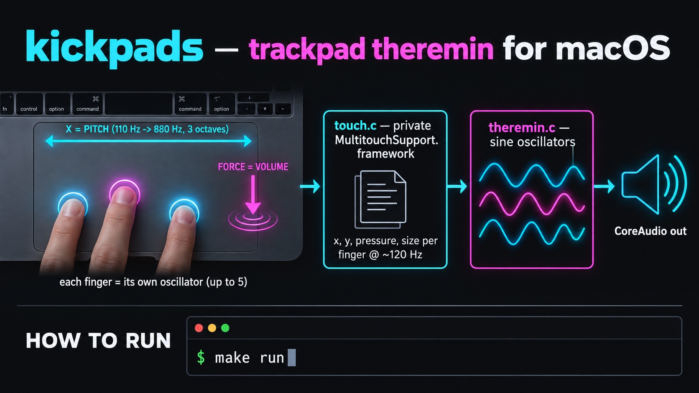

# kickpads



**English** · [Русский](#русский)

A MacBook trackpad turned into a polyphonic theremin. It reads raw per-finger data
(position, force, contact size) from Apple's private `MultitouchSupport.framework`
and drives sine oscillators through CoreAudio. Proof of concept: the first step towards
a trackpad kick/bass sampler and MIDI/MPE controller.

## What works

- **X → pitch**: 3 octaves (110 → 880 Hz), exponential, smooth glide while you slide
- **Force → volume**: light touch is quiet, a firm press is loud
- **Polyphony**: every finger is its own oscillator, up to 5 at once
- Click-free: per-voice smoothing, soft clipping when many fingers are down
- No permissions needed; tested on macOS 27 (Apple Silicon)

`y` and contact size are already read but not mapped yet.

## Run

Requires Xcode Command Line Tools (`xcode-select --install`).

```sh
make run      # build and play, prints per-finger data
./theremin    # play without debug output
```

Put fingers on the trackpad, slide left/right for pitch, press harder for volume.
`Ctrl+C` to quit.

> The system cursor still moves and clicks while you play. That will be suppressed later.

## How it works

```
trackpad ──▶ touch.c ──────────────▶ theremin.c ─────────▶ CoreAudio
             MultitouchSupport       sine per finger
             (dlopen, ~120 Hz)       lock-free atomics
```

- `touch.h` / `touch.c` is the core. It loads the private framework with `dlopen`, mirrors the
  96-byte `MTTouch` C struct and calls a handler with the fingers in contact on each frame.
  It knows nothing about sound.
- `theremin.c` is one consumer. The touch thread writes target frequency and amplitude
  into `_Atomic float`s, and the audio render callback smooths towards them.

Pressure units are raw device values: about 20 for a light touch, 400 for a firm press
(full volume), and up to about 1200 for a hard press.

## Roadmap

- [ ] MIDI/MPE bridge as a second `touch.h` consumer (virtual CoreMIDI port, works with
      MPE synths and ROLI-compatible hosts)
- [ ] Map `y` to timbre / vibrato
- [ ] Pad mode for kick and bass, step sequencer
- [ ] Suppress cursor movement while playing

## Caveats

`MultitouchSupport` is a private, undocumented API. It can break with any macOS update and
rules out the Mac App Store. Struct layout follows
[OpenMultitouchSupport](https://github.com/Kyome22/OpenMultitouchSupport) and
[TrackWeight](https://github.com/krishkumar/TrackWeight).

---

## Русский

Тачпад MacBook как полифонический терменвокс. Программа читает сырые данные каждого
пальца (координаты, силу нажатия, площадь касания) из приватного
`MultitouchSupport.framework` и озвучивает их синусными осцилляторами через CoreAudio.
Это proof of concept, первый шаг к сэмплеру бочки и баса и к MIDI/MPE-контроллеру
на тачпаде.

## Что работает

- **X → высота тона**: 3 октавы (110 → 880 Гц) по экспоненте, плавное глиссандо при скольжении
- **Сила нажатия → громкость**: при лёгком касании тихо, при сильном нажатии громко
- **Полифония**: у каждого пальца свой осциллятор, до 5 одновременно
- Без щелчков: каждый голос сглаживается, при многих пальцах включается мягкое ограничение
- Разрешения не нужны, проверено на macOS 27 (Apple Silicon)

`y` и площадь касания уже читаются, но пока ни на что не влияют.

## Запуск

Нужны Xcode Command Line Tools (`xcode-select --install`).

```sh
make run      # собрать и играть, с выводом данных по пальцам
./theremin    # играть без отладочного вывода
```

Положи пальцы на тачпад: влево-вправо меняется высота, сильнее нажатие — громче.
Выход по `Ctrl+C`.

> Пока играешь, системный курсор всё ещё двигается и кликает. Это уберём позже.

## Как устроено

```
тачпад ──▶ touch.c ──────────────▶ theremin.c ─────────▶ CoreAudio
           MultitouchSupport       синус на палец
           (dlopen, ~120 Гц)       атомики без блокировок
```

- `touch.h` / `touch.c` — ядро. Оно подгружает приватный фреймворк через `dlopen`,
  повторяет 96-байтную C-структуру `MTTouch` и в каждом кадре вызывает обработчик со
  списком пальцев, касающихся тачпада. Про звук ядро ничего не знает.
- `theremin.c` — один из потребителей ядра. Поток тачпада пишет целевые частоту и
  громкость в `_Atomic float`, аудио-callback плавно подтягивается к ним.

Давление приходит в сырых единицах устройства: около 20 при лёгком касании, 400 при
плотном нажатии (это полная громкость), до ~1200 при сильном.

## Планы

- [ ] MIDI/MPE-мост как второй потребитель `touch.h` (виртуальный CoreMIDI-порт для MPE-синтов
      и ROLI-совместимых хостов)
- [ ] `y` → тембр / вибрато
- [ ] Режим пэдов для бочки и баса, степ-секвенсор
- [ ] Блокировать курсор во время игры

## Ограничения

`MultitouchSupport` — приватный недокументированный API. Он может сломаться с любым
обновлением macOS, и с ним нельзя попасть в Mac App Store. Раскладка структур взята из
[OpenMultitouchSupport](https://github.com/Kyome22/OpenMultitouchSupport) и
[TrackWeight](https://github.com/krishkumar/TrackWeight).

## License

MIT, see [LICENSE](LICENSE).
